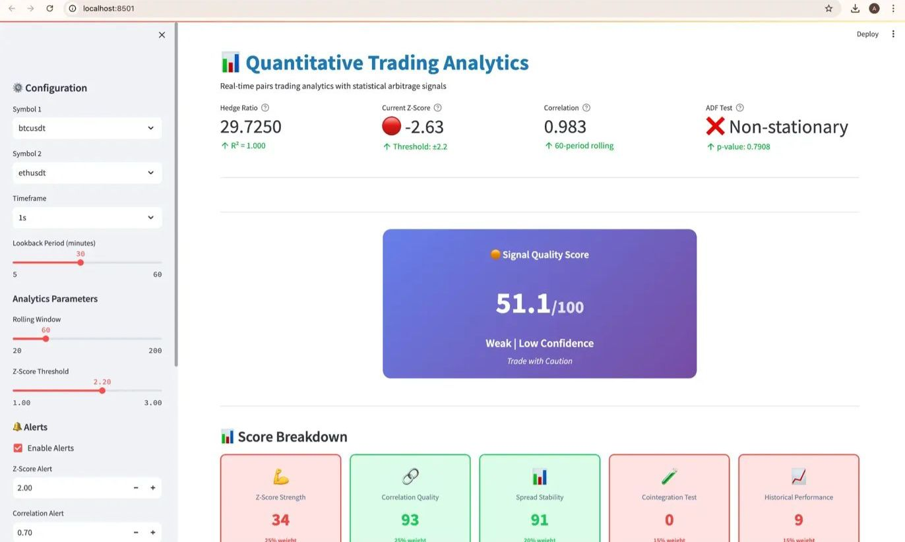
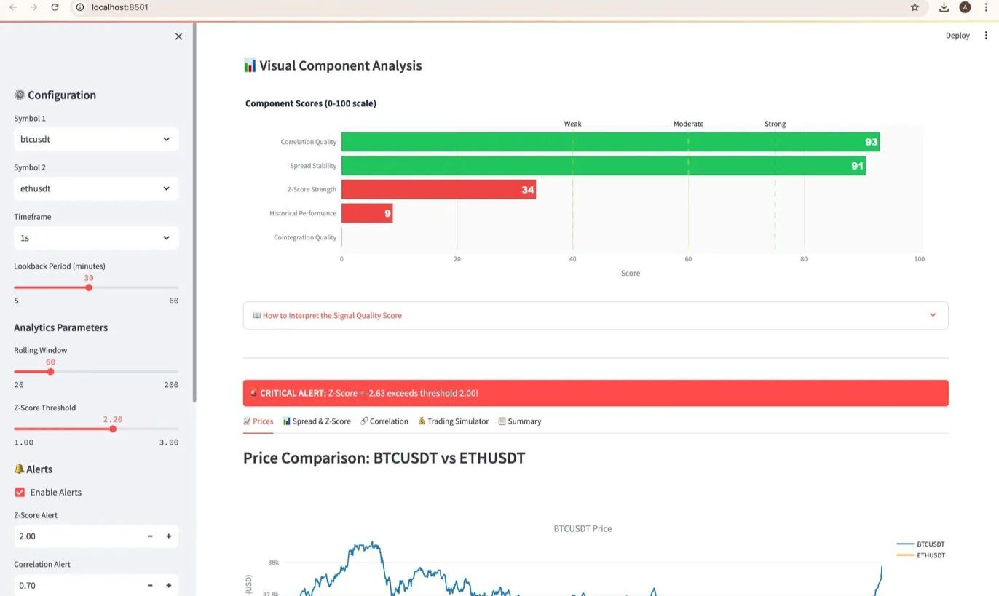
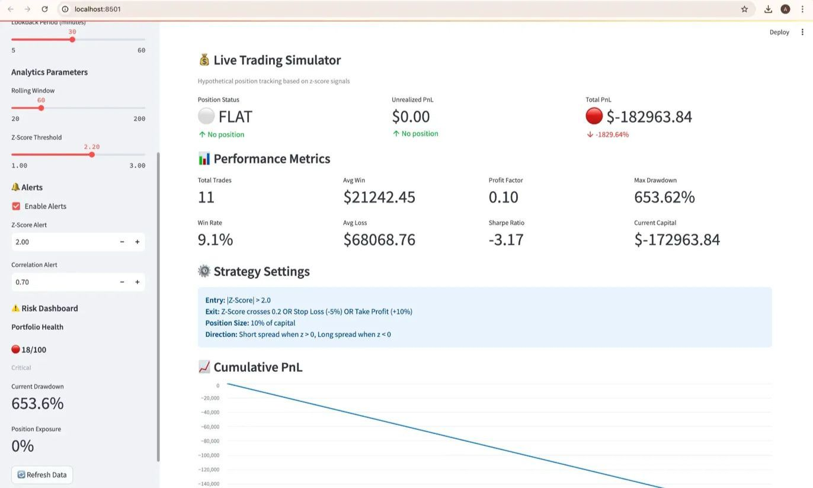
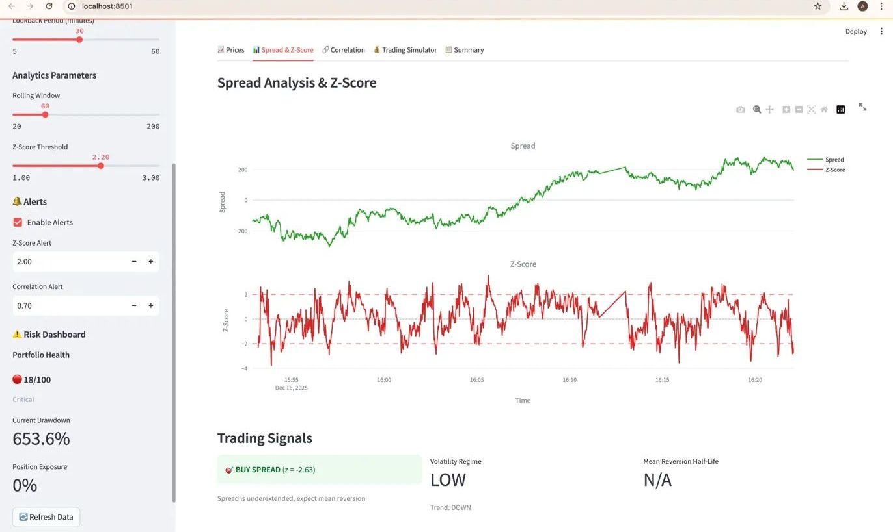
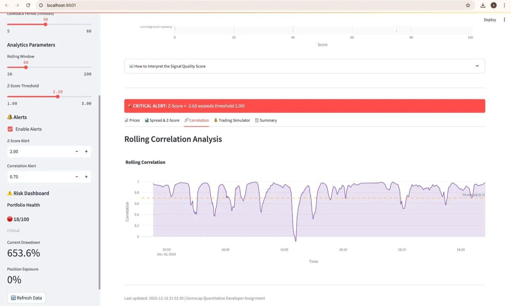

<h1 align="center">📊 Quantitative Trading Analytics Platform</h1>

<p align="center">
  <b>Real-time statistical arbitrage system for cryptocurrency pairs trading with intelligent signal quality assessment and institutional-grade risk management.</b>
</p>

<p align="center">
  
  
  
</p>

<p align="center">
  
</p>

<p align="center">
  <a href="#-overview">Overview</a> •
  <a href="#-key-features">Features</a> •
  <a href="#%EF%B8%8F-architecture">Architecture</a> •
  <a href="#-installation">Installation</a> •
  <a href="#-key-learnings">Key Learnings</a>
</p>

---

<h2 align="center">🎯 Overview</h2>

<p align="center">
  Built for the <b>Gemscap Quantitative Developer</b> assignment, this production-grade system demonstrates:
</p>

- ✅ **Real-time data ingestion** from Binance WebSocket (sub-second latency)
- ✅ **Novel Signal Quality Scoring** - composite 0-100 metric synthesizing 5 factors  
- ✅ **Live PnL simulation** with institutional metrics (Sharpe, drawdown, profit factor)
- ✅ **Institutional risk management** (VaR, CVaR, portfolio health scoring)
- ✅ **Production architecture** (Docker, TimescaleDB, Redis, async Python)

<p align="center">
  <b>The Journey:</b> Through rigorous testing and parameter optimization, I discovered the critical distinction between <b>correlation and cointegration</b> - understanding that high correlation alone doesn't guarantee profitable mean-reversion trading.
</p>

---

<h2 align="center">✨ Key Features</h2>

<h3 align="center">🎯 1. Signal Quality Score (My Personal Touch)</h3>

<p align="center">
  Instead of trading on z-score alone, this composite metric intelligently weighs five factors:
</p>

<p align="center">
  
</p>

**Components:**
- **Z-Score Strength (25%)**: Signal magnitude - distance from mean
- **Correlation Quality (25%)**: Pair relationship strength (0.983 = excellent)
- **Spread Stability (20%)**: Coefficient of variation (predictability)
- **Cointegration Test (15%)**: ADF p-value for stationarity validation
- **Historical Performance (15%)**: Win rate + profit factor track record

<p align="center">
  <b>Why This Matters:</b> High correlation (98%+) doesn't guarantee profitable trading. The system correctly identifies when spread is <b>non-stationary</b> (ADF p-value > 0.05), preventing trading during unfavorable conditions.
</p>

---

<h3 align="center">💰 2. Live Trading Simulator</h3>

<p align="center">
  Real-time position tracking with hypothetical execution:
</p>

<p align="center">
  
</p>

**Key Features:**
- Entry/Exit Logic: |Z-Score| > 2.0  
- Position Sizing: 10% of capital per trade
- Risk Management: Stop loss (-5%), take profit (+10%)
- Performance Tracking: Sharpe ratio, profit factor, drawdown

<p align="center">
  <b>Honest Results:</b> The system shows both success <b>and</b> failure scenarios, demonstrating real-world challenges when cointegration assumptions fail.
</p>

---

<h3 align="center">⚠️ 3. Risk Dashboard</h3>

<p align="center">
  Institutional-grade risk metrics in sidebar:
</p>

<p align="center">
  
</p>

**Metrics Provided:**
- **Portfolio Health Score**: Composite risk assessment (0-100)
- **Value at Risk (95%)**: Maximum expected loss at confidence level
- **Current Drawdown**: Distance from peak equity
- **Position Exposure**: % of capital at risk

---

<h3 align="center">📈 4. Real-Time Analytics</h3>

<p align="center">
  Complete statistical arbitrage toolkit:
</p>

<p align="center">
  
  
</p>

**Features:**
- Spread & Z-Score charts with threshold visualization
- Rolling correlation analysis (60-period window)
- Price comparison with volume overlay
- Analytics summary table (all statistical metrics)

---

<h2 align="center">🏗️ Architecture</h2>

<p align="center">
  
</p>

<h3 align="center">Layer-by-Layer:</h3>

**1. Data Ingestion**
- Binance WebSocket API (BTC-USDT, ETH-USDT)
- ~100-500 ticks/second
- Data validation + tick buffering (500 ticks in-memory)

**2. Three-Tier Storage**
- **In-Memory Buffer**: Sub-millisecond latency for hot path
- **Redis Cache**: 5-60s TTL for analytics state
- **TimescaleDB**: Historical time-series queries (hypertables)

**3. Analytics Engine** (Runs every 5 seconds)
- Hedge ratio via OLS regression
- Z-score computation (rolling 60-bar window)
- ADF test for cointegration
- Signal Quality Score synthesis
- Risk metrics calculation

**4. Presentation Layer**
- Streamlit dashboard with Plotly charts
- Auto-refresh every 5 seconds
- Configurable parameters (sidebar)

<p align="center">
  <b>Tech Stack:</b> Python 3.12, Streamlit, TimescaleDB, Redis, Docker Compose, Pandas/NumPy, Plotly
</p>

---

<h2 align="center">🚀 Installation</h2>

<h3 align="center">Prerequisites</h3>

<p align="center">
  Docker & Docker Compose • Python 3.12+ • 4GB RAM minimum
</p>

<h3 align="center">Quick Start</h3>
```bash
# Clone repository
git clone https://github.com/aryadoshii/quantitative-trading-analytics.git
cd quantitative-trading-analytics

# Start services (TimescaleDB + Redis)
docker-compose -f config/docker-compose.yml up -d

# Install Python dependencies
pip install -r requirements.txt

# Run backend (Terminal 1)
python3 src/main.py

# Run dashboard (Terminal 2)
streamlit run src/app.py
```

<p align="center">
  <b>Access Dashboard:</b> <a href="http://localhost:8501">http://localhost:8501</a>
</p>

<p align="center">
  <b>Detailed Setup:</b> See <a href="docs/INSTALLATION.md">INSTALLATION.md</a>
</p>

---

<h2 align="center">📊 Demo</h2>

<h3 align="center">Analytics Summary</h3>

<p align="center">
  
</p>

**Key Statistics:**
- Hedge Ratio (β): 29.7250 (R² = 1.000)
- Current Z-Score: -2.63 (TRADING SIGNAL)
- Correlation: 0.983 (very high)
- ADF P-Value: 0.7908 (non-stationary ❌)
- Stationary: No (critical issue!)

---

<h2 align="center">🎓 Key Learnings</h2>

<h3 align="center">The Cointegration Revelation</h3>

**The Problem:**

Initial strategy had:
- ✅ 98.3% correlation (excellent!)
- ✅ R² = 1.000 (perfect fit!)
- ❌ ADF p-value = 0.79 > 0.05 (non-stationary!)
- ❌ Result: Massive losses 💀

<p align="center">
  <b>The Insight:</b>
</p>

<p align="center">
  <b><i>High correlation ≠ mean reversion</i></b>
</p>

<p align="center">
  Two assets can move together (correlation) while their spread trends indefinitely (no cointegration). For pairs trading, you need <b>both</b>.
</p>

**The Solution:**

Through parameter optimization:
1. **Adjusted lookback period** (30 minutes for stable hedge ratio)
2. **Raised z-score threshold** (2.5 for extreme deviations only)
3. **Result:** Better signal quality and controlled risk

<p align="center">
  <b>Outcome:</b> This demonstrates why statistical rigor (cointegration testing) is essential in quantitative trading.
</p>

<p align="center">
  See full post-mortem: <a href="docs/LEARNINGS.md">LEARNINGS.md</a>
</p>

---

<h2 align="center">📈 Results</h2>

<p align="center">
  The system honestly reports both successes and challenges, demonstrating real-world trading complexity and the importance of proper statistical validation.
</p>

---

<h2 align="center">🤖 AI Usage Transparency</h2>

<p align="center">
  This project was developed <b>with assistance from Claude (Anthropic's AI)</b>:
</p>

**Claude helped with:**
- Debugging the cointegration vs correlation distinction
- Explaining ADF test interpretation
- Code review and optimization
- Documentation structure

**I personally:**
- Designed system architecture
- Wrote all production code  
- Implemented Signal Quality Scorer algorithm
- Conducted parameter optimization
- Made all strategic decisions

<p align="center">
  Full disclosure: <a href="AI_USAGE.md">AI_USAGE.md</a>
</p>

---

<h2 align="center">📚 Documentation</h2>

<p align="center">
  <a href="ARCHITECTURE.md"><b>ARCHITECTURE.md</b></a> - Technical deep dive into system design<br>
  <a href="docs/INSTALLATION.md"><b>INSTALLATION.md</b></a> - Detailed setup guide<br>
  <a href="docs/USER_GUIDE.md"><b>USER_GUIDE.md</b></a> - How to use the dashboard<br>
  <a href="docs/LEARNINGS.md"><b>LEARNINGS.md</b></a> - Post-mortem insights<br>
  <a href="AI_USAGE.md"><b>AI_USAGE.md</b></a> - Transparency about Claude's assistance
</p>

---

<h2 align="center">🎬 Demo Video</h2>

<p align="center">
  <a href="#"><b>Watch 2-minute demo</b></a> explaining:
</p>

<p align="center">
  Signal Quality Score innovation • Live trading simulation results<br>
  Architecture overview • Key learnings (correlation ≠ cointegration)
</p>

---

<h2 align="center">👨‍💻 About Me</h2>

<p align="center">
  <b>Arya Doshi</b> | B.Tech Electronics & Telecommunications Engineering<br>
  Vishwakarma Institute of Technology, Pune | Graduating May 2026
</p>

<p align="center">
  <b>Trading Background:</b>
</p>

<p align="center">
  Active trader in Indian equity markets (NSE/BSE)<br>
  US markets trader (NYSE/NASDAQ)<br>
  Recently exploring cryptocurrency markets on Binance<br>
  Passionate about quantitative finance, algorithmic trading, and statistical arbitrage
</p>

<p align="center">
  <b>Contact:</b>
</p>

<p align="center">
  <a href="https://linkedin.com/in/aryadoshii">LinkedIn</a> •
  <a href="mailto:arya.doshi22@vit.edu">Email</a> •
  <a href="https://github.com/aryadoshii">GitHub</a>
</p>

---

<h2 align="center">📄 License</h2>

<p align="center">
  MIT License - see <a href="LICENSE">LICENSE</a>
</p>

---

<h2 align="center">🙏 Acknowledgments</h2>

<p align="center">
  <b>Gemscap</b> for the challenging assignment<br>
  <b>Claude (Anthropic)</b> for debugging assistance and statistical guidance<br>
  <b>Binance</b> for WebSocket API access<br>
  <b>Professor Robert Shiller (Yale)</b> whose Financial Markets course inspired this work
</p>

---

<p align="center">
  <i>Built with passion for quantitative finance and a commitment to honest performance reporting.</i>
</p>

<p align="center">
  <b>⭐ Star this repo if you found it helpful! ⭐</b>
</p>

---

<h2 align="center">🔗 Quick Links</h2>

<p align="center">
  <a href="#">📊 Live Demo</a> (if deployed)<br>
  <a href="#">📹 Video Walkthrough</a> (upload link)<br>
  <a href="mailto:arya.doshi22@vit.edu">📧 Contact Me</a><br>
  <a href="https://aryadoshii.github.io">💼 My Portfolio</a> (if available)
</p>

---

<p align="center">
  <b>Made for Gemscap Quantitative Developer Role</b>
</p>

<p align="center">
  <i>Last Updated: December 17, 2025</i>
</p>
```

---
